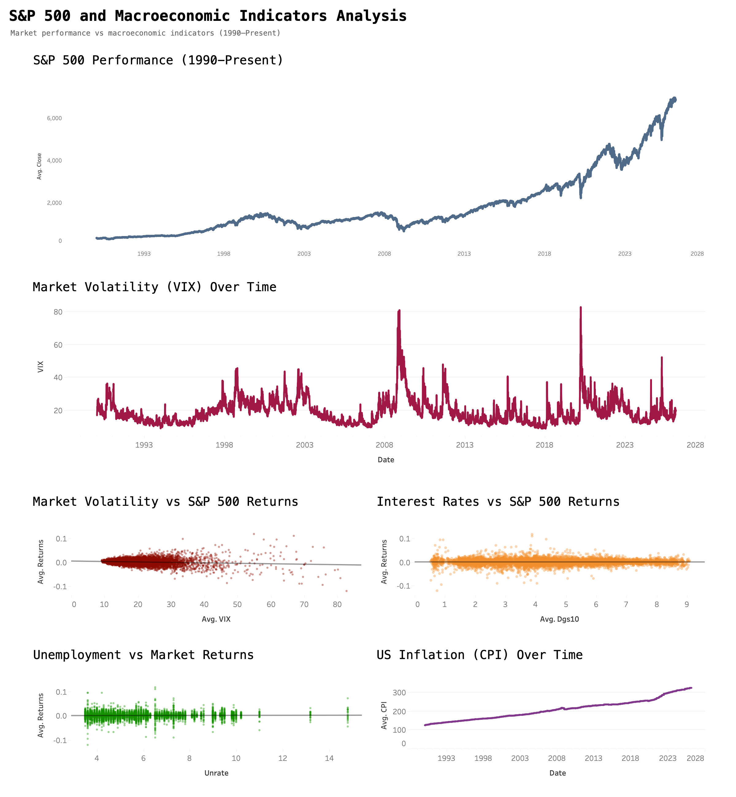

# S&P 500 & Macroeconomic Indicators Dashboard

This project analyzes the relationship between the U.S. stock market and key macroeconomic indicators using data visualization and exploratory data analysis.

The dashboard explores how volatility, interest rates, unemployment, and inflation interact with market performance.

Dashboard Preview

Key Insights

1. Long-term market growth

The S&P 500 shows a strong upward trend since 1990 despite several economic crises.

2. Volatility and market returns

Higher volatility (VIX) is associated with more extreme market returns and increased uncertainty.

3. Weak short-term macro relationships

Interest rates and unemployment show relatively weak relationships with daily market returns.

4. Inflation trend

U.S. inflation has steadily increased over time, with a clear acceleration after 2020.

Tools Used
- Python
- Pandas
- Tableau
- Data visualization
- Financial data analysis

Dataset
The dataset combines historical financial and macroeconomic indicators:

- S&P 500 index
- VIX volatility index
- US inflation (CPI)
- Unemployment rate
- 10Y Treasury yield
- Federal funds rate

Time range:
1990 – Present
